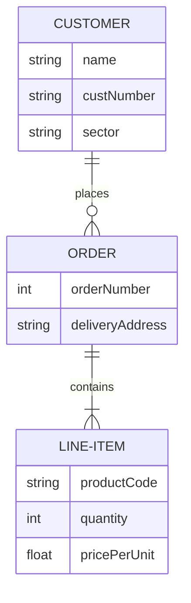

# Proyecto XXX

## Descripción

Proyecto XXX, es un microservicio Spring Boot 3.1.9, que hace muchas cosas....

## Arquitectura

Para los microservicios estamos usando una Arquitectrura Hexagonal.
Consta de 3 capas principales:

- **Dominio**
  Esta capa contiene los Servicios y el Modelo de Negocio, y cualquier cosa relacionada con el solamente.
  En los arquetipos actuales solo usamos el Modeo Anémico (Anemic Model), si queremos usar el Modelo Enriquecido (Rich Model) esta capa contendra los puertos de salida, del repositorio y de los eventos kafka, y no la capa Aplicación.

- **Aplicación**
  Esta capa contiene los puertos de comunicación con la capa Infrestructura, no es necesario un puerto de entrada, ya que es redundante en Java llamar a una interfaz si no se va a usar para nada mas.
  Tambien contiene los servicios que realizaran los casos de uso, haciendo uso del domain como considere oportuno.
  Las clases de datos en esta capa no existen ya que son el Dominio.

- **Infraestructura**
  Esta capa contiene los Servicios de comunicación externa de nuestra aplicacion. Se divide a si misma en los paquetes necesarios para desacoplar cada entrada y salida posible, se pueden crear nuevos si es necesario pero se han predefinido estos para estas funcionalidades:
    - **ApiRest**
      Contiene los Controladores, Dtos, Seguridad y clases necesarias para la comunicacion por Api Rest
    - **IntegrationEvents**
      Contiene los Consumidores, Productores y clases necesarias para la comunicacion por Eventos
    - **Repository**
      Contiene los Repositorios, Dtos y clases necesarias para la persistencia de datos

## Diagrama de Entidad-Relacion

## Endpoints

Explicaicon de cada endpoint de la aplicacion

## Swagger

No se necesita de ninguna configuracion adicional para configurar Swagger.

El endpoint que se genera para poder visualizar el Api es:
- /swagger-ui/index.html

El Json con la descripcion:
- /v3/api-docs

Para desactivar estas URL en entornos productivos hay que poner estas propiedades:
- springdoc.api-docs.enabled: false
- springdoc.swagger-ui.enabled: false

## Contribuye

Aqui pondriais vuestro mail o informacion de contacto.
