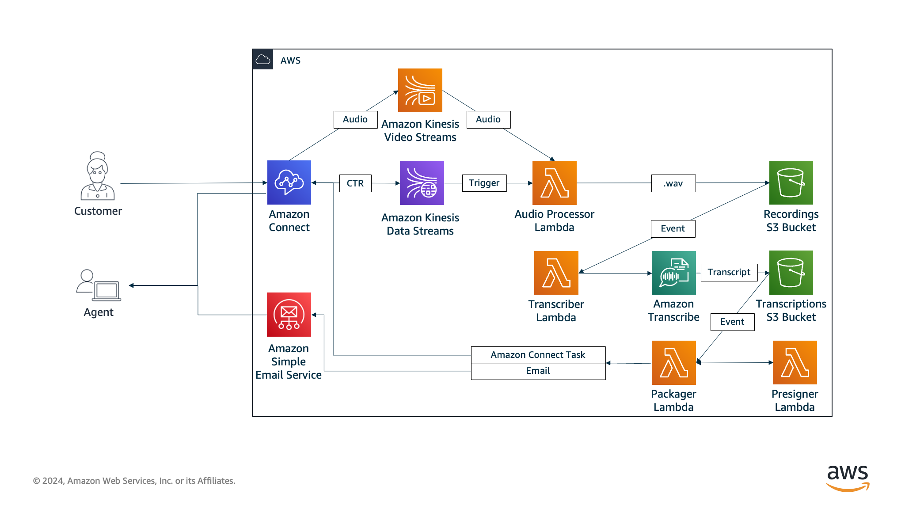

# Voxpress 
It's a Full Stack Application developed in Angular and Springboot for Voicemail Management in Amazon Connect. Voxpress integrates with Voicemail Express, a feature designed to provide basic voicemail functionality to Amazon Connect. You easily manage all the voicemails your customers leave. You can listen to them, archive the ones you've handled, or assign them to someone on your team for follow-up.

# Front-End
[Go to Front End](https://github.com/pghb15/voxpress/tree/main/Front/voxpress-front)

# Back-End
[Go to Back End](https://github.com/pghb15/voxpress/tree/main/Back/voxpress-back)

# More about Voicemail Express V3
Voicemail Express is designed to provide basic voicemail functionality to Amazon Connect. It has been designed to work seamlessly behind the scenes, providing voicemail options for all agents and queues by default. It is an evolution of the Voicemail Express solution that was created specifically for Service Cloud Voice customers by the AWS team that worked with Salesforce to develop Service Cloud Voice. That solution has been cloned and included with Service Cloud Voice, and is now used at scale by customers on that offering. This version removes the Salesforce-centric options, providing the same easy-to-deploy-and-use voicemail option for standard Amazon Connect customers. Typically speaking, Voicemail Express can be deployed and validated in less than 15 minutes. 

# Visit VXM3 Repository
[Voicemail Express Official Repository]([Docs/vmx_prerequistes.md](https://github.com/amazon-connect/voicemail-express-amazon-connect))
